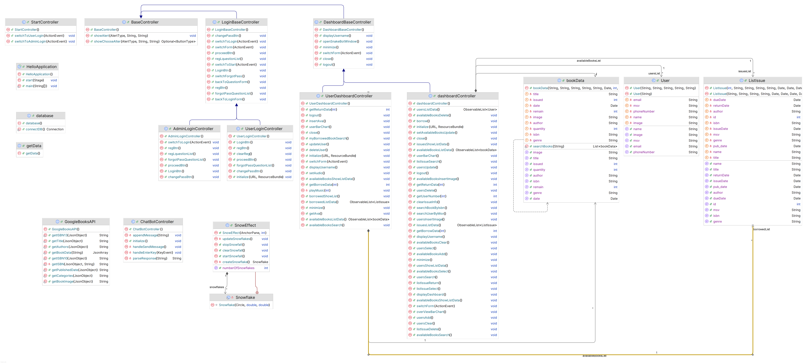

# Snake_LibraryManagement
## Author
Group Snake

  1. Phạm Thúc Việt Anh
  2. Nguyễn Hoàng Hà Anh
  3. Phạm Ngọc Huyền

## Description
The application is designed for librarians to manage their library. The application is written in Java and uses the JavaFX library. The application is based on the MVC model. The target users of this application are librarians and users. The application's data is stored and managed in SQL.

  1. The application is designed to manage library
  2. The application is written in Java and uses the JavaFX library
  3. The application is based on the MVC model
  4. The application is for librarians and users
  5. The application uses SQL database to store data

## UML Diagram

## Installation 
  1. Clone the project from the repository.
  2. Open the project in the IDE.
  3. Run the project.

## Usage
  1. Select Usage Mode: Choose between user or admin mode.
  2. Login or Sign Up: Log in to an existing account or create a new one.
  3. Admin Features:
  - Dashboard: Displays available books in the library, total issued books, and total users. Includes two charts for statistics on book borrowing/returning and user activity by month.
  - Book Management: Allows querying books from Google Books and the library's collection. Admins can add, delete, update books, and clear the entire library collection.
  - User Management: Manages the list of library users, with permissions to add, delete, and query user information.
  - Issue Books: Handles book borrowing requests from users.
  - All Issued Books: Queries books that have been borrowed or returned.
  4. User Features:
  - Dashboard: Includes a chart for statistics on books borrowed/returned by month. Users can update their personal information. The "Total Borrowed Books" section shows the number of books borrowed.
  - My Borrowed Books: Queries information about books borrowed by the user.
  - Library: Displays books available in the library.
  - Music Player: Users can play, pause, and switch between songs in a pre-provided playlist from the publisher.
  - SnakeBot: A chatbot using the Gemini 1.5 flash API to provide useful information about books users are interested in. It can translate and paraphrase responses in multi-language.
  5. To logout account click the out icon in the bottom-left of the scence. To exit app click the exit icon in the right-top. 

## Demo

## Future improvements
  1. Add book comments
  2. Add wishlist
  3. Add a function to let users play their audio
  4. Add more seasonal event effects
  5. Improve SnakeBot
  6. 

## Contributing
Pull requests are welcome. For major changes, please open an issue first to discuss what you would like to change.

## Project status
The project is completed.

## Note
The application is written for educational purposes.
